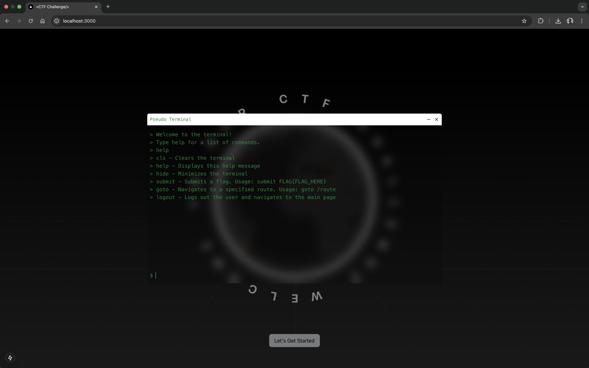

# CPTS 580 CTF Challenge

This is a **Capture The Flag (CTF) challenge platform** developed for **CPTS 580** by **Sheheryar Ahmad Pirzada** and **Aashik Sharif**. The platform consists of various security challenges, including **Decoder, SQL Injection, and IDOR exploits**, designed to test participants' cybersecurity skills.

This project is built using **Next.js**, **Prisma ORM**, **MySQL**, and runs in a **Dockerized environment**.

## 📸 Screenshots
Here are some screenshots of the application:

### **Landing Page**


### **Terminal View**


---

## 🚀 Getting Started

### **Prerequisites**
Make sure you have the following installed:

- [Docker](https://www.docker.com/)
- [Node.js](https://nodejs.org/)
- [npx (Included with Node.js)](https://www.npmjs.com/package/npx)

---

## 🔥 **Run the CTF Challenge Locally**

This project uses **Docker Compose** to set up the **Next.js application** and **MySQL database**. Follow these steps to get started:

### **1️⃣ Clone the repository**
```bash
git clone https://github.com/sheheryar-pirzada/cpts-580-ctf-challenge.git
cd cpts-580-ctf-challenge
```

### **2️⃣ Start the Application with Docker**
Run the following command to start the **Next.js app** and **MySQL database**:
```bash
docker-compose up -d
```
This will:
- Start the **Next.js** application
- Spin up a **MySQL database**

### **3️⃣ Apply Prisma Migrations**
Once the MySQL container is running, apply the database schema using Prisma:
```bash
npx prisma migrate dev --name init
```

### **4️⃣ Seed the Database**
Before starting challenges, you need to seed some initial data:
```bash
npx prisma db seed
```

### **5️⃣ Access the Application**
Once everything is set up, open your browser and visit:
```bash
http://localhost:3000
```

---

## 📖 **CTF Challenge Overview**
This CTF platform includes multiple challenges where participants exploit vulnerabilities to retrieve hidden flags.

Each challenge is designed to simulate real-world security vulnerabilities in web applications.

---

## 🛠 **Development & Debugging**
For development mode (without Docker), run:
```bash
npm install
npm run dev
```
This will start the Next.js development server at `http://localhost:3000`.

### **Database Management**
Use Prisma Studio to view and manage your database records:
```bash
npx prisma studio
```

---

## 🚀 **Deployment**
To deploy the Next.js app and database, build the Docker images:
```bash
docker compose up --build -d
```
For production, ensure environment variables are configured properly.

---

## 🤝 **Contributors**
- **Sheheryar Ahmad Pirzada**
- **Aashik Sharif**
